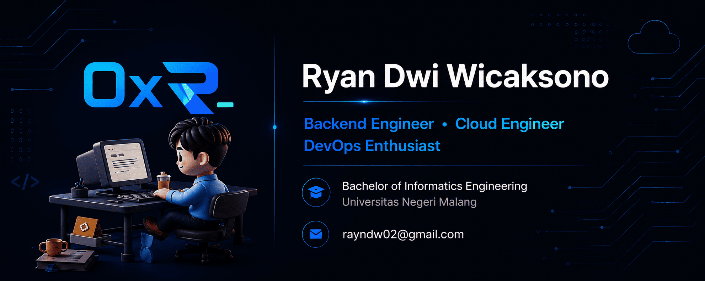

## About Me

Hey, I'm Ryan, a backend, cloud, and DevOps engineer from Probolinggo, Indonesia.

I focus on building scalable backend systems, managing cloud infrastructure on GCP and AWS, and automating deployments through CI/CD pipelines and containerized services.

---

## Tech Stack

**Backend**
Go · Gin · Laravel · PHP · Node.js · Express.js · Python · C#

**Frontend**
React · Next.js · TypeScript · JavaScript · Inertia.js

**Database**
MySQL · PostgreSQL · MongoDB · Redis · Firebase · Supabase

**Cloud & DevOps**
GCP · AWS · Docker · Terraform · GitHub Actions · CI/CD

**Automation & Tools**
Git · GitHub · n8n

---

  

